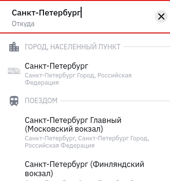
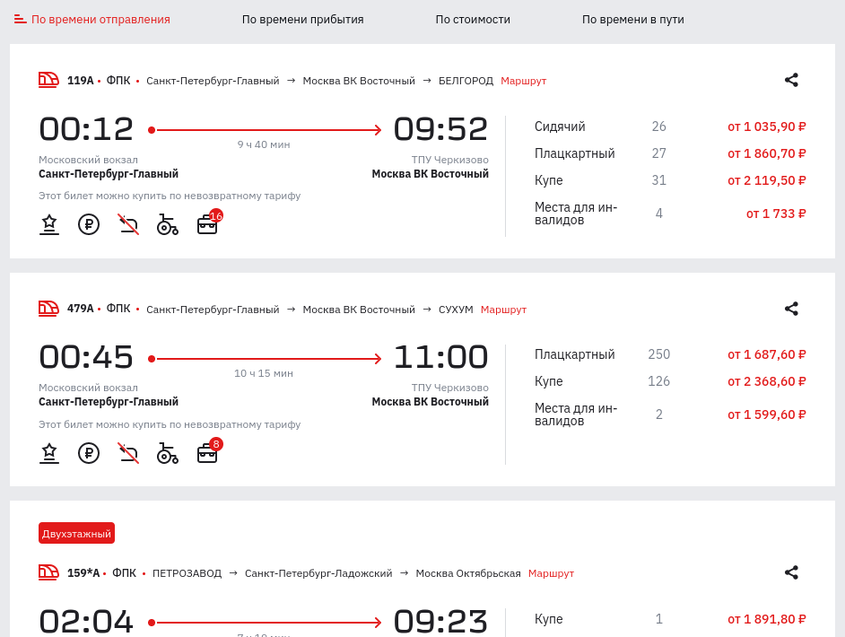
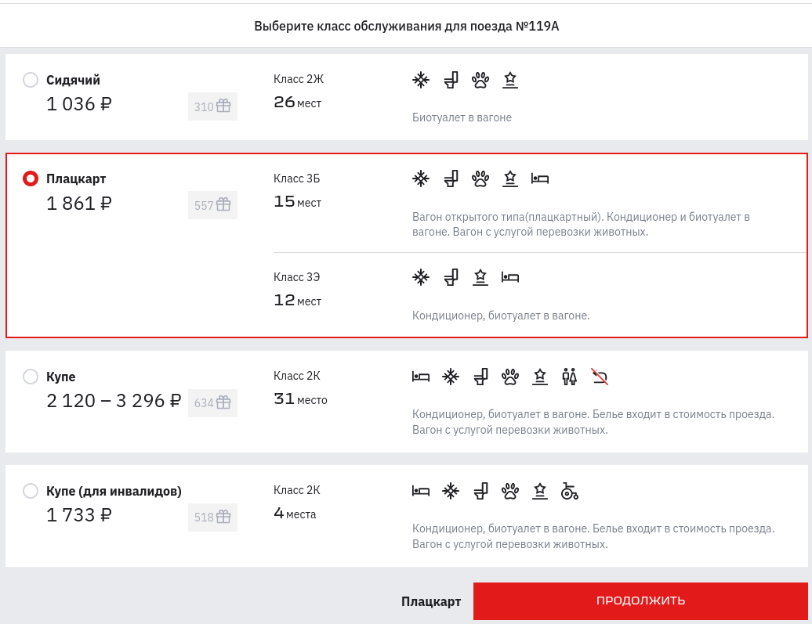
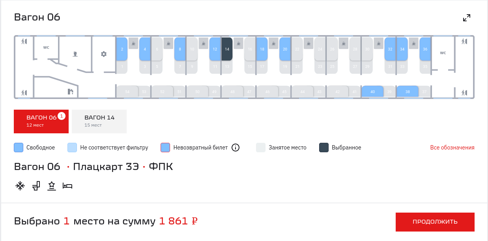

== Шаг 3: Выбор рейса, класса обслуживания и мест

Чтобы выбрать подходящий рейс:
[start=1]
. На главной странице сайта укажите пункт отправления в поле *Откуда* и пункт назначения в поле *Куда*.
+

+
Чтобы выбрать конкретный вокзал или аэропорт, в поле *Откуда* или *Куда* прокрутите список значений вниз.  
+

. Выберите дату поездки в поле *Туда*.  
+
Можно сразу приобрести обратный билет, указав дату обратной поездки в поле *Обратно*.
. Нажмите кнопку *НАЙТИ*.
+
Появится список рейсов, соответствующих заданным критериям выбора.
+

+
Список рейсов можно отсортировать по времени отправления, времени прибытия, стоимости и времени в пути.
. Выберите подходящий рейс из списка и щелкните по нему.
+
Появится страница для выбора класса обслуживания на данном рейсе.
+

. Выберите подходящий класс обслуживания и нажмите кнопку *ПРОДОЛЖИТЬ*.
+
Появится страница для выбора места на данном рейсе.
+

. Укажите требуемое место или места и нажмите кнопку *ПРОДОЛЖИТЬ*.
+
Появится страница для ввода информации о пассажирах. Перейдите к шагу 4.

