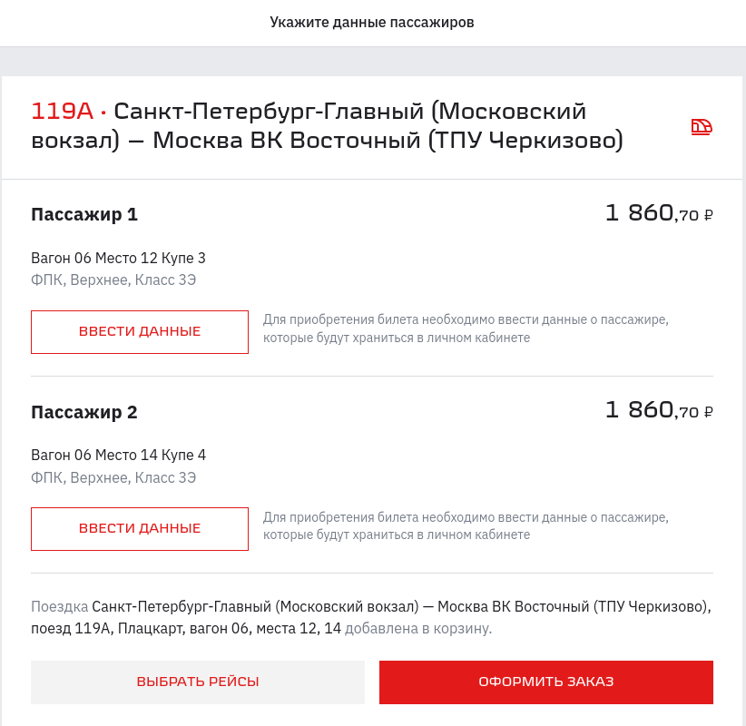
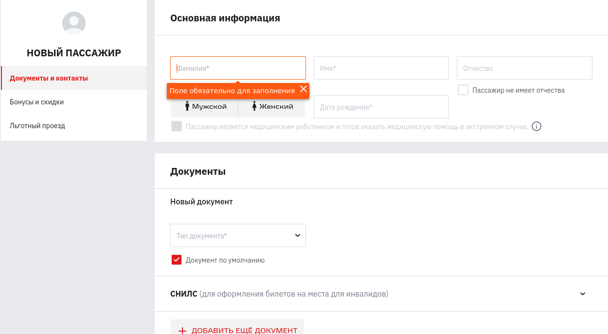

== Шаг 4: Ввод информации о пассажирах
Данные пассажиров можно ввести заранее в профиле пользователя или в процессе покупки билетов.

Чтобы ввести информацию о пассажирах в процессе покупки билетов:
[start=1]
. На странице для ввода информации о пассажирах нажмите кнопку *ВВЕСТИ ДАННЫЕ*.
+

+ 
Появится страница с анкетой пассажира: 
+

. Заполните анкету … TBD 

